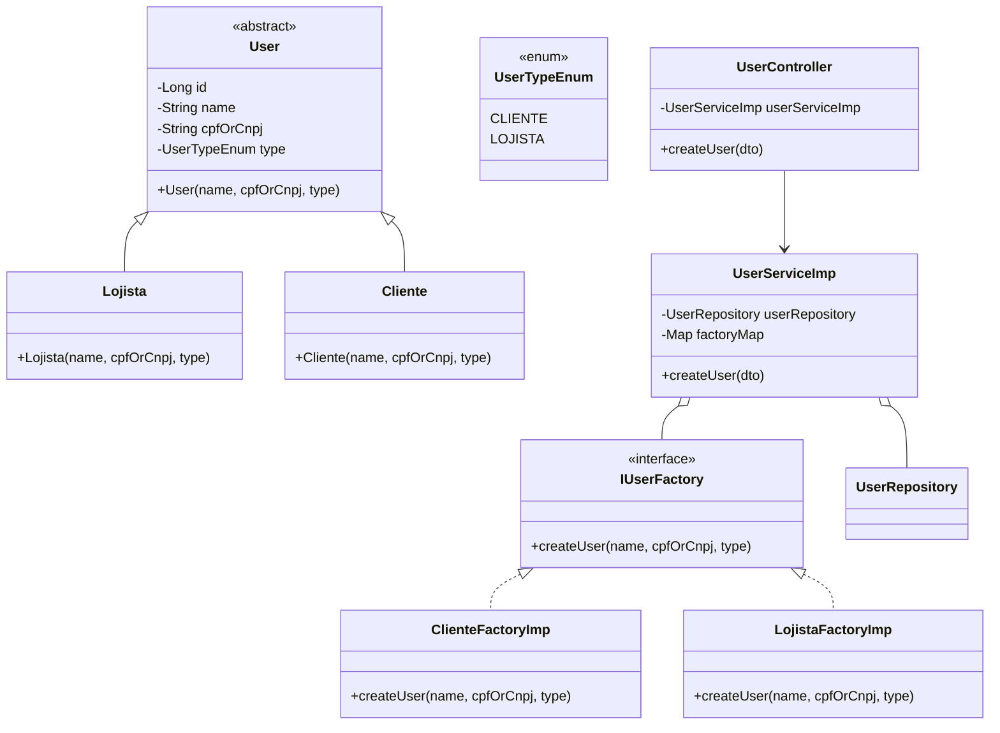

# Factory Method: Implementação para Criação de Usuários

Este documento explica a implementação do padrão **Factory Method** em um sistema de gerenciamento de usuários com Spring Boot e JPA, mostrando como criar diferentes tipos de usuários de forma flexível e desacoplada.

## 📐 Diagrama de Classes



## 🧩 Componentes Principais

# 1. Modelagem de Domínio
Classe Base User

```java
@MappedSuperclass
@Data
@NoArgsConstructor
public abstract class User implements Serializable {
    @Id
    @GeneratedValue(strategy = GenerationType.IDENTITY)
    private Long id;
    
    @Column(nullable = false)
    private String name;
    
    @Column(nullable = false)
    private String cpfOrCnpj;
    
    @Enumerated(EnumType.STRING)
    private UserTypeEnum type;
    
    public User(String name, String cpfOrCnpj, UserTypeEnum type) {
        this.name = name;
        this.cpfOrCnpj = cpfOrCnpj;
        this.type = type;
    }
}

```
classes concretas

```java

@MappedSuperclass
@Data
@NoArgsConstructor
public abstract class User implements Serializable {
    @Id
    @GeneratedValue(strategy = GenerationType.IDENTITY)
    private Long id;
    
    @Column(nullable = false)
    private String name;
    
    @Column(nullable = false)
    private String cpfOrCnpj;
    
    @Enumerated(EnumType.STRING)
    private UserTypeEnum type;
    
    public User(String name, String cpfOrCnpj, UserTypeEnum type) {
        this.name = name;
        this.cpfOrCnpj = cpfOrCnpj;
        this.type = type;
    }
}
```

Enumeração de tipos

```java

public enum UserTypeEnum {
    CLIENTE("CLIENTE"),
    LOJISTA("LOJISTA");

    private String type;

    UserTypeEnum(String type) {
        this.type = type;
    }

    public String getType() {
        return type;
    }
}

```

## 2. Implementação do Factory Method

interface da factory

```java

public interface IUserFactory {
    User createUser(String name, String cpfOrCnpj, UserTypeEnum type);
}

```

Factories Concretas

```java

public class ClienteFactoryImp implements IUserFactory {
    @Override
    public User createUser(String name, String cpfOrCnpj, UserTypeEnum type) {
        return new Cliente(name, cpfOrCnpj, type);
    }
}

public class LojistaFactoryImp implements IUserFactory {
    @Override
    public User createUser(String name, String cpfOrCnpj, UserTypeEnum type) {
        return new Lojista(name, cpfOrCnpj, type);
    }
}

```

## 3. Camada de Serviço.

```java
@Service
public class UserServiceImp implements IUserService {
    private final UserRepository userRepository;
    private final Map<UserTypeEnum, IUserFactory> factoryMap;

    public UserServiceImp(UserRepository userRepository) {
        this.userRepository = userRepository;
        this.factoryMap = new HashMap<>();
        this.factoryMap.put(UserTypeEnum.CLIENTE, new ClienteFactoryImp());
        this.factoryMap.put(UserTypeEnum.LOJISTA, new LojistaFactoryImp());
    }

    @Transactional
    @Override
    public void createUser(UserRequestDto dto) {
        IUserFactory factory = factoryMap.get(dto.type());
        if (factory != null) {
            userRepository.save(factory.createUser(dto.name(), dto.cpfOrCnpj(), dto.type()));
        } else {
            throw new IllegalArgumentException("Tipo de usuário inválido");
        }
    }
}

```

## 4. Controller(API REST)

```java
@RestController
@RequestMapping(value = "/users")
public class UserController {
    private final UserServiceImp userServiceImp;

    public UserController(UserServiceImp userServiceImp) {
        this.userServiceImp = userServiceImp;
    }

    @PostMapping
    public ResponseEntity<User> createUser(@RequestBody @Valid UserRequestDto dto) {
        userServiceImp.createUser(dto);
        return ResponseEntity.status(HttpStatus.CREATED).build();
    }
}

```

## ✅ Benefícios da Implementação
# Baixo Acoplamento
- O controller e service trabalham apenas com interfaces
- Não conhecem as implementações concretas de usuário
# Extensibilidade Fácil
- Adicionar novo tipo de usuário requer:
- Nova classe de usuário
- Nova factory
- Atualização do enum
# Princípio da Responsabilidade Única
- Cada classe tem uma única responsabilidade clara
- Fábricas cuidam apenas da criação
- Service cuida da lógica de negócio
# Testabilidade
- Fácil de mockar as factories em testes unitários
- Isolamento das dependências